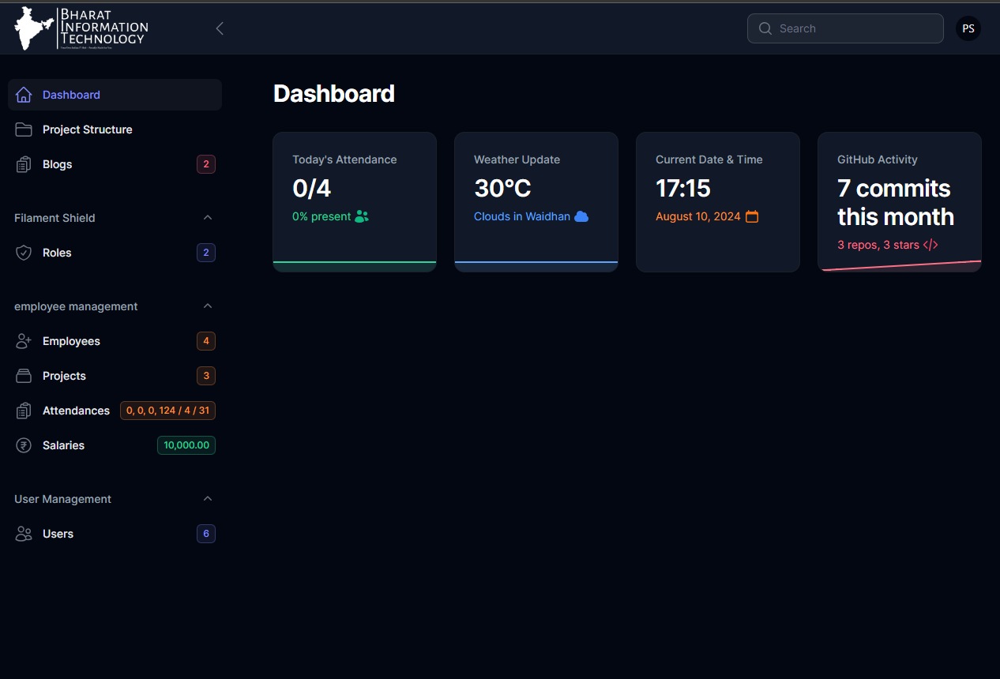
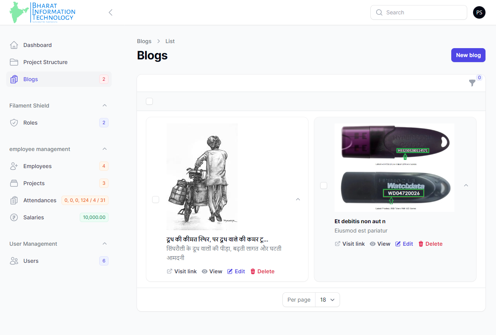
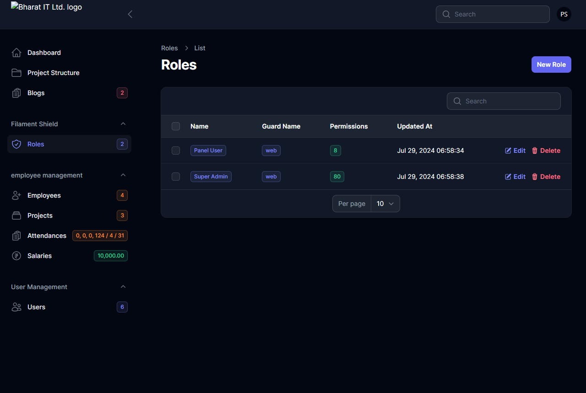

# BharatIt

## Screenshots

### Dashboard



### Blogs



### Roles



### Logo For Light


### Logo For Dark


This is an admin panel of information technology tech company for employee management as well as project management it is created by Prem Sagar Shah using [Filament PHP](https://filamentphp.com/).

## Technologies

-   PHP (Laravel)
-   Filament PHP

## Local Installation

1. Clone the repository

```
git clone https://github.com/Prem812/BharatIt.git
```

2. Run the following commands -


Change Directory

```
cd OpenCRM
```


install php dependencies

```
composer install
```


install JavaScript dependencies

```
npm install
```


build assets

```
npm run build 
```


Setup Configuration

```
cp .env.example .env
```


Verify your Database Connection

```
DB_CONNECTION=mysql
DB_HOST=127.0.0.1
DB_PORT=3306
DB_DATABASE=your_database_name
DB_USERNAME=root
DB_PASSWORD=
```

Generate Key

```
php artisan key:generate
```


Migrate and Seed Database

```
php artisan migrate:fresh --seed
```


Optionally, you can create the dummy data by running the seeder as -

```php artisan db:seed
```


Run the project on your local machine

```
php artisan serve
```

## Need assistance for creating new pages?


you can go through filaments doucumentation or create using these commands:

-  firstly you should create a model with migration table

```
php artisan make:model model_name -m
```

-  it will create a new model in your project with your model name and it will also create a new migration table in your project modify the migration table as what you need

-  run the command 

```
php artisan migrate
```

for resource

```
php artisan make:filamentresource Model_NameResource --generate --view
```

and there you go

for more information go through the [documentation](https://filamentphp.com/docs/3.x/panels/installation)


If you need help customizing this application or want to create your own application like this, contact me on [LinkedIn](https://www.linkedin.com/in/prem-sagar-shah-267921174/).
